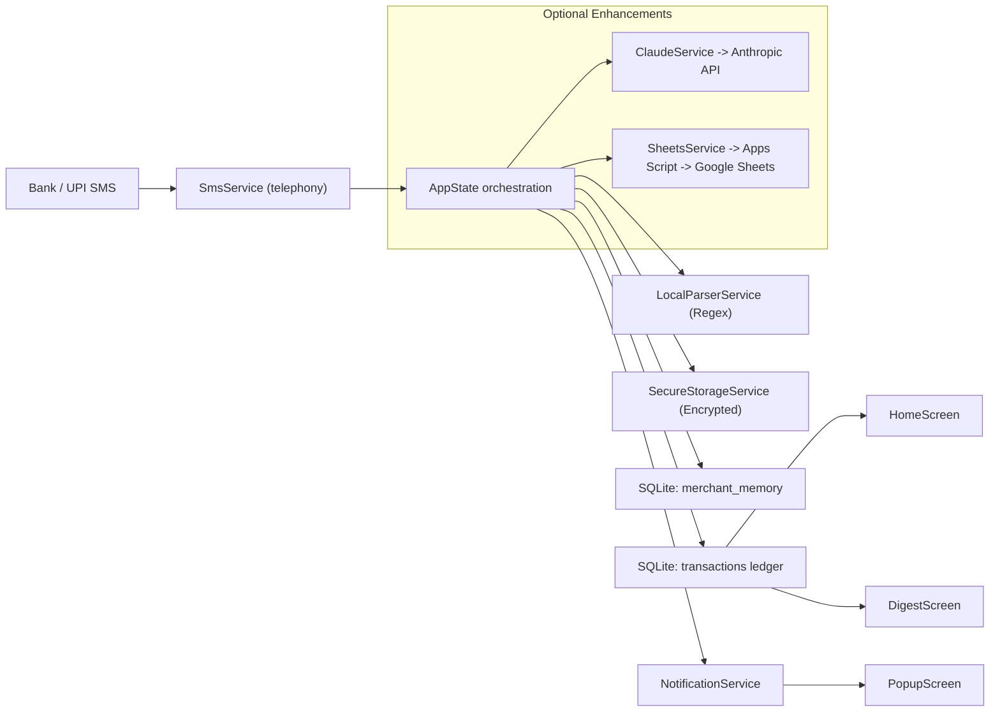
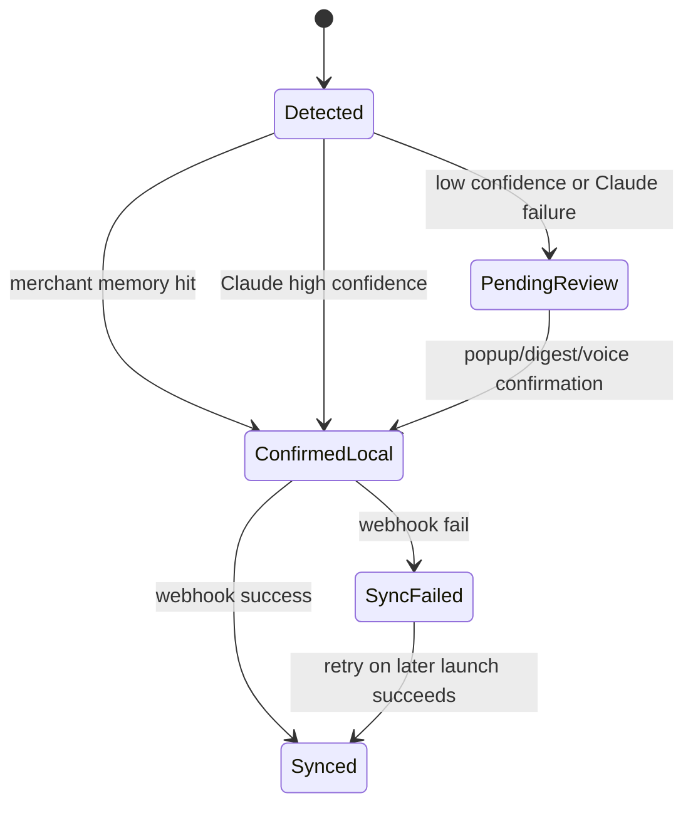

# SpendSense Repository Context

Last updated: 2026-04-18

## Purpose of this document

This file is meant to be the durable handoff context for future development of SpendSense.

It explains:

- what the app is trying to do
- how the current codebase is actually structured
- which files matter and what responsibility each one owns
- how data moves end to end through the system
- what cases are handled today
- what edge cases still need design or hardening
- what the next steps should be for alpha launch and beyond

This document is intentionally detailed so a future developer can enter the repo, understand the current implementation quickly, and continue work without rebuilding the mental model from scratch.

## 1. Product Summary

SpendSense is an Android-first, local-first expense capture app for Indian UPI and bank-payment SMS flows.

**Core Philosophy: Zero-Hurdle.** The app is designed to work immediately upon installation with no API keys or technical setup required.

The intended user experience is:

1. The user makes a payment.
2. The bank or UPI app sends an SMS.
3. SpendSense detects that SMS.
4. The app parses the SMS **locally** using regex and keywords to find the merchant, amount, and category.
5. Every transaction is stored locally on device.
6. **Optional AI:** If the user provides a Claude API key, the app uses it to categorize complex or ambiguous messages.
7. **Optional Sync:** If the user provides a Google Sheets Webhook (or signs in with Google), high-confidence transactions sync automatically.
8. Low-confidence transactions are routed to a quick confirmation popup and to an evening digest review flow.
9. Once the user confirms a merchant/category relationship, SpendSense remembers it locally for future auto-categorisation.

## 2. Current Production Stage

### Practical stage assessment

SpendSense is currently pivoting from a Cloud-Required prototype to a Local-First alpha build.

What that means in practice:

- The main product loop exists in code.
- The app can function without any external API keys.
- Incoming payment-like SMS can enter the pipeline.
- Transactions are stored in a local SQLite ledger before or alongside sync.
- Low-confidence flows are reviewable through popup and digest UIs.
- Failed Google Sheets syncs are retained locally and retried on next app launch.
- Merchant memory exists and can learn from user-confirmed decisions.

What prevents this from being called production-ready:

- **Local Parser Hardening:** The local regex engine needs to be robust across varied bank SMS formats.
- **Onboarding UX:** The setup screen needs to be made optional/skippable.

### Recommended label to use internally

`SpendSense is a local-first Android alpha build with zero-hurdle transaction capture, manual-review flows, and optional AI/Cloud sync enhancements.`

## 3. High-Level Architecture

### Core architecture in one sentence

SpendSense is a Flutter Android app whose central orchestrator (`AppState`) receives payment-like SMS events, classifies them using **Local Regex (LocalParserService), Merchant Memory, and Optional AI (Claude)**, persists them to a local SQLite ledger, and optionally syncs them to Google Sheets. Sensitive data is protected via **SecureStorageService**.

### High-level system diagram



### Runtime responsibility breakdown

| Layer | Main responsibility | Source of truth |
|---|---|---|
| UI | Show setup, recent history, popup review, digest review | Flutter widget tree + `AppState` |
| Orchestration | Decide how an SMS should move through the system | `lib/state/app_state.dart` |
| Local data | Persist configuration, merchant memory, transactions | `SecureStorageService` + SQLite |
| Local parsing | Regex-based bank SMS parsing | `LocalParserService` |
| AI classification | Parse ambiguous SMS and voice notes | `ClaudeService` |
| Sync | Write structured rows to Google Sheets | `SheetsService` + `backend/apps_script.js` |
| Notifications | Prompt for pending review and route taps | `NotificationService` |
| Device integrations | Receive SMS and capture voice notes | `SmsService` + `VoiceService` |

### Important design truth

The authoritative device-side record of transaction history is now the local SQLite `transactions` table, not Google Sheets.

Google Sheets is currently best understood as:

- a sync target
- a reporting/export surface
- a user-visible long-term log

It is not a safe sole ledger because sync can fail, duplicate, or be delayed.

### Domain boundaries

The current domain model explicitly supports:

- `EXPENSE`
- `LOAN`

It does not yet explicitly support:

- `INCOME`
- `REFUND`
- `REVERSAL`
- `FAILED PAYMENT`
- `CASH WITHDRAWAL`
- `SELF TRANSFER`

This matters because the SMS filter is broad, so some credited or received-money messages can still enter the pipeline even though the model does not yet have a first-class type for them.

## 4. Repo Map

## Top-level directories and files

| Path | Purpose | Notes |
|---|---|---|
| `lib/` | Main Flutter app source | This is the heart of the product |
| `backend/apps_script.js` | Google Apps Script webhook backend | Required for Google Sheets sync |
| `android/` | Android app wrapper and manifest/build config | Most relevant platform folder because SMS is Android-only |
| `ios/` | iOS Flutter scaffold | Product is not functionally complete on iOS because SMS ingestion is Android-only |
| `macos/`, `linux/`, `windows/`, `web/` | Generated Flutter platform scaffolding | Useful only for packaging or future non-core expansion |
| `test/` | Flutter/Dart tests | Currently very light coverage |
| `build/` | Generated build outputs | Not source of truth, should not be used as design context |
| `README.md` | Lightweight project overview | Good quick start, not a full architecture doc |
| `SpendSense_Codebase_TODO.md` | Earlier flaw inventory and design TODOs | Historical context |
| `SpendSense_Alpha_Launch_Checklist.md` | Alpha readiness checklist | Useful operational checklist |
| `analysis_options.yaml` | Dart analyzer settings | Includes one lint suppression for library doc comments |
| `pubspec.yaml` | Flutter dependencies and metadata | Defines app packages and build inputs |
| `android_manifest_additions.xml` | Legacy/reference manifest snippet | No longer the live manifest; can confuse future developers |

## Source ownership by folder

### `lib/core`

- Cross-app constants and configuration keys.

### `lib/models`

- Data structures for transactions and merchant memory.

### `lib/services`

- All external integration and storage helpers.
- This includes SMS, Claude, Sheets sync, SQLite, notifications, voice, and recent-summary querying.

### `lib/state`

- Central app workflow orchestration and state machine.

### `lib/ui/screens`

- User-facing screens for onboarding, home timeline, pending popup, and digest review.

## 5. Detailed Component-by-Component Understanding

## 5.1 Entry point and navigation

### `lib/main.dart`

This file owns app bootstrap.

Responsibilities:

- initializes Flutter bindings
- checks whether onboarding is complete via `SharedPreferences`
- creates the top-level `ChangeNotifierProvider<AppState>`
- defines the global `navigatorKey`
- declares route configuration

Route map:

- `'/setup'` -> onboarding setup screen
- `'/home'` -> main timeline / dashboard
- `'/digest'` -> pending-review digest
- `'/popup'` -> transaction review popup, created through `onGenerateRoute`
- `'/setup-settings'` -> settings version of setup screen, also through `onGenerateRoute`

Important architectural note:

`navigatorKey` exists primarily so `NotificationService` can route the user from a notification tap into the correct screen even when there is no immediate `BuildContext`.

## 5.2 Global constants

### `lib/core/constants.dart`

This file centralizes application constants.

It currently contains:

- Anthropic endpoint/model/version config
- `SharedPreferences` keys
- SQLite database name/version/table names
- confidence labels
- transaction type labels
- sync state labels
- SMS filter keywords
- default categories
- notification IDs/channel info
- digest schedule defaults

Important details:

- DB version is `2`.
- The app uses a fixed digest schedule of 9:00 PM India time through `digestHour`, `digestMinute`, and `digestTimeZone`.
- `prefDigestTime` exists but is not currently wired into any settings UI or runtime scheduling logic.
- `legacyPrefWebhookUrl` is unusual: it stores the old literal preference key/value path from a previous build, and the app still attempts migration from it.

## 5.3 Data models

### `lib/models/transaction.dart`

Defines the main runtime transaction object: `MyTransaction`.

Fields:

| Field | Meaning |
|---|---|
| `id` | App-generated transaction identifier |
| `timestamp` | When the transaction object was created in the app |
| `amount` | Parsed INR amount |
| `merchant` | Merchant name, UPI handle, or person name |
| `category` | Category like `Food` or placeholder `ASK_USER` |
| `confidence` | `HIGH` or `LOW` |
| `type` | `EXPENSE` or `LOAN` |
| `note` | Additional context, often from voice or AI |
| `rawSms` | Original SMS content when available |
| `isLogged` | Whether sync to Sheets succeeded |
| `isConfirmed` | Whether the user or system considers classification final |

Important factory constructors:

- `fromClaudeResponse(...)`
  Converts AI JSON into a transaction object.

- `manualReview(...)`
  Creates a fallback transaction when AI classification fails.

Important helpers:

- `copyWith(...)`
- `toSheetJson()`
- `requiresUserInput`
- `isLoan`

Important behavioral note:

`MyTransaction` is the in-memory app model, but the richer operational truth lives in SQLite because the database also tracks `needs_user_input`, `sync_status`, `last_error`, `sender`, `created_at`, and `updated_at`.

### `lib/models/merchant_memory.dart`

Defines `MerchantMemory`, the app’s local merchant-learning dictionary.

Fields:

| Field | Meaning |
|---|---|
| `id` | SQLite row ID |
| `merchantKey` | Normalized merchant identifier |
| `category` | User-confirmed category |
| `type` | `EXPENSE` or `LOAN` |
| `count` | How many times the merchant has been seen/confirmed |
| `lastSeen` | Last time this mapping was updated |

Key method:

- `normalise(String raw)`
  Lowercases, trims, and compresses whitespace.

Important design truth:

Merchant memory currently learns only from explicit user confirmations.

It is updated in:

- `confirmCategory(...)`
- `confirmWithVoice(...)`

It is not updated after an unknown merchant is auto-accepted purely because Claude returned `HIGH` confidence. That keeps the memory conservative, but it also means some repeat merchants may continue going through AI instead of becoming instant memory hits.

## 5.4 Local storage and local-first ledger

### `lib/services/local_storage_service.dart`

This is one of the most important files in the repo.

It owns:

- SQLite initialization
- schema creation
- schema migration
- merchant-memory lookup/write
- transaction upsert/read/update/delete
- pending review queries
- recent confirmed query
- retry queue query for failed/unsynced sync

### Database schema

The app creates two logical tables:

#### `merchant_memory`

Columns:

- `id`
- `merchant_key`
- `category`
- `type`
- `count`
- `last_seen`

Purpose:

- persistent, local, exact-match merchant learning

#### `transactions`

Columns:

| Column | Meaning |
|---|---|
| `id` | Primary key |
| `timestamp` | Transaction event time stored as epoch ms |
| `amount` | Numeric amount |
| `merchant` | Merchant/person label |
| `category` | Category or `ASK_USER` |
| `confidence` | `HIGH` or `LOW` |
| `type` | `EXPENSE` or `LOAN` |
| `note` | Free-text note |
| `raw_sms` | Original SMS text |
| `sender` | SMS sender address if available |
| `is_logged` | Whether Sheets sync succeeded |
| `is_confirmed` | Whether user/system confirmed classification |
| `needs_user_input` | Whether it should appear in popup/digest queues |
| `sync_status` | `pending`, `synced`, or `failed` |
| `last_error` | Latest sync/classification error note |
| `created_at` | Ledger row creation time |
| `updated_at` | Last update time |

### Migration logic

DB version `2` introduces the new `transactions` table and migrates legacy rows from `pending_MyTransactions`.

Migration intent:

- preserve pending history from earlier builds
- convert older schema rows into the new local-first ledger
- move from a queue-only model toward a full transaction ledger

### Important methods

| Method | What it does |
|---|---|
| `lookupMerchant(...)` | Exact-match merchant memory lookup |
| `saveMerchantMemory(...)` | Inserts or updates a merchant memory row |
| `upsertTransaction(...)` | Inserts or replaces a ledger row while preserving `created_at` |
| `getPending()` | Returns transactions needing user input and not yet confirmed |
| `findTransactionById(...)` | Retrieves one ledger row by ID |
| `getRecentConfirmed(...)` | Returns recent confirmed transactions for home feed |
| `getConfirmedPendingSync()` | Returns confirmed transactions not yet synced successfully |
| `markConfirmed(...)` | Marks a transaction confirmed and clears user-input flag |
| `markSynced(...)` | Marks ledger row successfully synced |
| `markSyncFailed(...)` | Marks sync failure and stores last error |
| `deleteTransaction(...)` | Removes a transaction from ledger |

### Key architecture interpretation

This file effectively makes SpendSense local-first.

If a future developer changes nothing else, this file must remain trustworthy because:

- the home screen depends on it
- retry logic depends on it
- pending review depends on it
- notification routing depends on it
- any future analytics/search/export will depend on it

## 5.5 Read models and summaries

### `lib/services/recent_transactions_service.dart`

This file builds read-oriented views on top of the local ledger.

Responsibilities:

- fetch recent confirmed transactions
- calculate a current-month summary from local data

### `MonthlySummary`

The summary object currently exposes:

- total spent
- category totals
- transaction count
- current month
- derived top category
- a formatted total string

Important current behavior:

- summary includes only transactions with `type = EXPENSE`
- loans are excluded from spending totals
- unconfirmed transactions are excluded

This is consistent with the product’s current idea of “monthly spending,” but future versions may need separate loan, transfer, and income summaries.

## 5.6 Claude integration

### `lib/services/claude_service.dart`

This file handles all Anthropic/Claude interaction.

Responsibilities:

- build prompt for SMS classification
- send classification request
- parse JSON-only response
- create `MyTransaction` from AI output
- interpret voice note text into category/type/note
- validate API key during setup

### SMS classification contract

The SMS prompt asks Claude to return JSON with:

- `amount`
- `merchant`
- `category`
- `confidence`
- `type`
- `note`

It also instructs Claude to:

- classify Indian UPI/bank messages
- use `HIGH` or `LOW` confidence
- mark ambiguous transactions as `ASK_USER`
- output `LOAN` when text suggests giving money to a person

### Voice interpretation contract

When voice is used, Claude receives:

- the pending transaction amount
- the merchant/person label
- the spoken phrase

It returns:

- resolved category
- resolved type
- short note

### Failure behavior

If Claude fails because of:

- missing API key
- network problem
- non-200 response
- malformed JSON

then:

- `categorise(...)` returns `null`
- `understandVoiceNote(...)` falls back to a safe default object

This is important: the app degrades into manual review rather than silently dropping the transaction.

### Current limitations

- The model prompt is carefully constrained, but parsing still assumes the response is valid JSON after minor cleanup.
- There is no structured retry/backoff policy for Claude failures.
- There is no explicit support for income/refund semantics in the domain model.

## 5.7 Google Sheets sync

### `lib/services/sheets_service.dart`

This file is the outbound sync client.

Responsibilities:

- read webhook URL from `SharedPreferences`
- migrate legacy webhook preference if found
- POST transaction JSON to Apps Script
- send test payload during setup
- batch-log a list of transactions if needed

### Important behavior

- If the webhook is missing or empty, sync fails fast.
- Sync is considered successful only if:
  - the HTTP status is `200`
  - the response JSON contains `{ "status": "success" }`

### Architectural role

This service should be treated as a best-effort sync layer, not the main ledger.

That distinction matters because:

- network can fail
- Apps Script can misbehave
- Google Sheets writes are not transactional
- retrying can produce duplicates if the backend is not idempotent

## 5.8 SMS ingestion

### `lib/services/sms_service.dart`

This file is the device-facing entry point for transaction ingestion.

Responsibilities:

- request SMS permissions
- register foreground and background SMS listeners
- filter messages to payment-like SMS
- queue background messages into `SharedPreferences`
- drain that queue on a later app launch
- expose `fetchRecentPaymentSms(...)` for possible backfill/debug flows

### Current behavior

Foreground path:

- incoming SMS is checked immediately
- if it looks payment-related, the `AppState` callback is invoked

Background path:

- SMS is filtered in the background handler
- matching messages are serialized into `SharedPreferences`
- they are not fully classified in the background handler itself
- processing happens later when the app launches and `processQueuedMessages()` runs

### SMS filter logic

`_isPaymentSms(...)` currently checks whether the SMS contains any keyword from `AppConstants.smsKeywords`.

This is intentionally broad.

It helps catch many transaction messages, but it also creates false-positive risk, especially for:

- credited messages
- incoming transfers
- refund messages
- general account alerts that happen to mention amount terms

### Important practical limitation

The app does not currently implement deterministic deduplication.

That means duplicate processing is possible if:

- the same SMS is received twice
- a message is processed in foreground and again through a queued background path
- a user restores or replays inbox messages in a future backfill flow

This is one of the most important next hardening tasks.

## 5.9 Voice input

### `lib/services/voice_service.dart`

This file wraps `speech_to_text`.

Responsibilities:

- initialize STT availability
- listen for up to 8 seconds
- return the final recognized words

Important details:

- locale is hardcoded to `en_IN`
- the service returns `null` if STT is unavailable
- there is no custom partial-result UI beyond a listening state

Voice is not a general assistant interface. It is specifically a quick-disambiguation tool for pending transactions.

## 5.10 Notifications and digest scheduling

### `lib/services/notification_service.dart`

This file handles two things:

- immediate low-confidence transaction notifications
- daily digest reminder scheduling

Responsibilities:

- initialize `flutter_local_notifications`
- request notification permission on Android
- create the notification channel
- schedule a daily reminder using timezone-aware scheduling
- open the correct route on notification tap

### Tap routing behavior

Notification payloads are JSON with a `kind` field.

Supported kinds:

- `transaction`
- `digest`

Routing behavior:

- `digest` -> pushes `'/digest'`
- `transaction` -> looks up the transaction by ID from local storage, then pushes `'/popup'`

### Digest schedule behavior

The digest is scheduled for:

- 9:00 PM
- `Asia/Kolkata`
- only when there is at least one pending transaction

If pending count goes to zero, the digest reminder is canceled.

### Important current limitations

- Transaction popup notifications all use the same notification ID (`1001`), so multiple low-confidence notifications overwrite one another instead of stacking.
- Notification taps resolve the transaction by ID even if it is already confirmed, so a stale notification can still reopen a popup for a transaction that no longer truly needs review.
- Digest scheduling is fixed-time and not user-configurable yet.

### `lib/services/digest_scheduler.dart`

This is now only a thin wrapper.

It delegates scheduling and immediate triggering to `NotificationService`.

This file exists mostly to preserve a clean intent boundary:

- `sync(...)` for scheduled digest state
- `triggerNow(...)` for manual/testing trigger

## 5.11 App orchestration and state machine

### `lib/state/app_state.dart`

This is the single most important orchestration file in the app.

If a new developer wants to understand the real product behavior, this is the first file to read after the models and storage service.

It owns:

- service composition
- startup initialization order
- incoming SMS handling
- pending list refresh
- transaction confirmation logic
- voice-confirmation flow
- retry of unsynced transactions
- digest loading/scheduling
- user-visible transaction-state transitions

### `TxState`

The app defines these high-level states:

- `idle`
- `smsReceived`
- `processing`
- `autoLogged`
- `awaitingUser`
- `confirmed`
- `logged`
- `error`

This is not a full formal state machine, but it provides enough state for UI indicators and messaging.

### Startup sequence

`initialise()` currently does this in order:

1. opens the database
2. initializes notifications
3. initializes voice
4. initializes SMS listener
5. drains queued background SMS messages
6. retries unsynced confirmed transactions
7. loads pending transactions
8. updates error message if SMS or notification permissions are missing
9. notifies listeners

### Incoming SMS orchestration

When a payment-like SMS arrives, `_onPaymentSmsReceived(...)` does:

1. set state to `smsReceived`
2. try to extract a merchant hint from the SMS
3. look up merchant memory using that hint
4. if merchant memory exists:
   save a high-confidence confirmed transaction locally
   try sync to Sheets
   mark `autoLogged` only if sync succeeds
5. if merchant memory does not exist:
   ask Claude to categorise the SMS
6. if Claude returns `null`:
   create a manual-review transaction
   save it locally as pending user input
   show a popup notification
   load pending list
   move to `awaitingUser` with an error message
7. if Claude returns `HIGH` confidence:
   save the transaction locally as confirmed
   try sync to Sheets
   mark `autoLogged` only if sync succeeds
8. if Claude returns `LOW` confidence:
   save locally as pending user input
   show popup notification
   refresh pending list
   move to `awaitingUser`

### Confirmation paths

There are three ways a pending transaction becomes final:

1. manual category tap in popup
2. voice confirmation in popup
3. bulk confirmation in digest

All of them eventually:

- set category and type
- mark the transaction confirmed locally
- save/update merchant memory
- attempt Sheets sync

### Retry behavior

On launch, `_retryUnsyncedTransactions()` fetches confirmed transactions whose `sync_status` is not `synced`, then retries them serially.

This gives the app an important recovery property:

- temporary network loss does not mean transaction loss

### Important orchestration truths

- `AppState` is the workflow brain of the app.
- The UI is intentionally thin.
- Business rules are centralized here rather than being scattered across screens.

This is good for a small alpha codebase, but later it may be worth splitting this file into explicit use-case classes such as:

- `ProcessIncomingSms`
- `ConfirmPendingTransaction`
- `RetryFailedSyncs`
- `ScheduleDigest`

## 5.12 Setup screen

### `lib/ui/screens/setup_screen.dart`

This file is both onboarding and settings editor.

It behaves differently depending on `isOnboarding`.

Responsibilities:

- load saved Claude key and webhook URL
- migrate legacy webhook preference if needed
- validate the Claude key live
- validate the webhook live
- save configuration only after both checks succeed
- mark onboarding complete

### Important behavior

- On first run, it is a full-screen onboarding flow.
- Later, it is reused as a settings page via `'/setup-settings'`.
- Save is blocked until both the Claude test and webhook test pass (only if fields are not empty).

### UX meaning

This screen is not just preferences storage. It is the app’s integration health gate.

## 5.12b Developer Tools screen

### `lib/ui/screens/developer_tools_screen.dart`

Internal utility screen for rapid state simulation.

Responsibilities:

- Inject simulated bank SMS (HDFC, SBI, ICICI, Axis)
- Force sync failures for retry testing
- Wipe local database tables for clean-state testing

Security:

- strictly gated by `foundation.kDebugMode`
- removed from production release builds

## 5.13 Home screen

### `lib/ui/screens/home_screen.dart`

This is the main dashboard.

Responsibilities:

- show current listener status
- show monthly expense summary
- show pending-review banner when needed
- show recent confirmed transactions
- route to settings
- route to digest when pending items exist

### Data sources

- listens to `AppState` for refresh triggers
- reads recent history and summary from `RecentTransactionsService`
- uses local ledger as source, not Google Sheets

### Important behavior

- pending banner opens digest
- status pill reflects:
  - missing SMS permission
  - processing in progress
  - background listening ready
- recent list includes confirmed transactions whether synced or not

This is important because the home screen is a local-truth view, not just a cloud-sync view.

## 5.14 Popup review screen

### `lib/ui/screens/popup_screen.dart`

This is the quick-review interface for low-confidence or manual-review transactions.

Responsibilities:

- show amount, merchant, time
- let the user tap a category directly
- let the user choose `Loan`
- allow voice-based description
- allow user to skip and handle it later through digest

### Current behavior

- category taps call `confirmCategory(...)`
- voice uses `confirmWithVoice(...)`
- successful voice confirmation closes the screen
- skip simply closes the screen and leaves the transaction pending

This screen is optimized for minimal friction and fast correction, not deep editing.

## 5.15 Digest review screen

### `lib/ui/screens/digest_screen.dart`

This is the batch-review surface for unresolved transactions.

Responsibilities:

- load pending items after screen mount
- show progress through pending items
- let user choose categories one by one
- let user confirm all selections at the end

### Important design choice

The digest is not a separate data model.

It is simply a UI over the same pending ledger rows that power popup review.

### Current operational behavior

- any unselected transaction is defaulted to `Others` when the user taps Done
- confirmation happens transaction by transaction
- each confirmation also attempts sync

### Current limitation

Because confirmation and sync are coupled, digest completion time depends on network behavior.

For a larger batch or slower network, this can make the final Done action slower than ideal. A future version should likely:

- confirm locally first
- queue sync separately

## 5.16 Backend webhook

### `backend/apps_script.js`

This file is the entire server-side integration layer right now.

It is a Google Apps Script web app that receives HTTP POSTs from the Flutter app and appends rows to spreadsheet tabs.

Responsibilities:

- parse JSON request body
- validate required fields
- select the correct sheet based on transaction type
- write expense rows to `Expenses`
- write loan rows to `Loans`
- return JSON success/error responses
- provide a simple GET health check

### Expense sheet write format

Expected columns:

- Date
- Time
- Amount
- Merchant
- Category
- Note
- Confidence
- Type

### Loan sheet write format

Expected columns:

- Date
- Time
- Amount
- Person
- Reason
- Status

### Important architectural reality

This backend is intentionally lightweight, but it has serious production tradeoffs:

- it is URL-based rather than authenticated with a strong app/user identity model
- it is append-only and non-idempotent
- duplicate retries can create duplicate rows
- leaked webhook URLs can be abused

For alpha this is acceptable. For broader external production it is not enough by itself.

## 5.17 Android wrapper

### `android/app/src/main/AndroidManifest.xml`

This is the live Android manifest, and it now contains the key permissions needed by the app:

- `RECEIVE_SMS`
- `READ_SMS`
- `INTERNET`
- `RECORD_AUDIO`
- `FOREGROUND_SERVICE`
- `RECEIVE_BOOT_COMPLETED`
- `POST_NOTIFICATIONS`

It also sets:

- app label to `SpendSense`
- main activity entry point
- Flutter embedding metadata

### `android/app/build.gradle.kts`

This file defines Android packaging.

Important current values:

- namespace: `com.spendsense.app`
- applicationId: `com.spendsense.app`

Important limitation:

- release builds still use debug signing

That is acceptable for local development and internal builds, but it must be replaced before a real alpha distribution.

### `android/app/src/main/kotlin/com/spendsense/app/MainActivity.kt`

Minimal Flutter activity bootstrap.

It contains no custom logic today.

This means almost all app behavior is implemented in Flutter/Dart, not in native Kotlin.

## 5.18 Tests

### `test/widget_test.dart`

Current coverage:

- onboarding setup screen renders correctly

### `test/transaction_model_test.dart`

Current coverage:

- manual-review transactions require user input
- `copyWith(...)` preserves values unless overridden

### What this means

The codebase now has a non-broken baseline test suite, but coverage is still minimal.

The most important missing automated coverage areas are:

- SMS orchestration in `AppState`
- ledger persistence behavior
- sync retry behavior
- notification routing
- migration behavior
- digest confirmation behavior

## 5.19 Project metadata and generated scaffolding

### `pubspec.yaml`

This file declares the Flutter package metadata and dependencies.

Notable runtime dependencies in active use:

- `provider`
- `telephony`
- `http`
- `sqflite`
- `path`
- `flutter_local_notifications`
- `speech_to_text`
- `shared_preferences`
- `timezone`

Dependencies present but not materially used in the current Dart codebase:

- `permission_handler`
- `intl`
- `json_annotation`

Notable dev dependencies:

- `flutter_test`
- `flutter_lints`
- `build_runner`
- `json_serializable`

If the team wants a tighter dependency surface, some of these can be removed or justified later.

### `analysis_options.yaml`

This is standard Flutter lint config with one custom analyzer override:

- ignore `dangling_library_doc_comments`

That override exists because many files begin with standalone library comments.

### Platform folders

These folders are mostly generated Flutter scaffolding:

- `ios/`
- `macos/`
- `linux/`
- `windows/`
- `web/`

Important product truth:

The repo is technically multi-platform because Flutter scaffolds it that way, but the actual product is currently Android-only in any meaningful sense because SMS capture is the core input and that is implemented through the Android-oriented `telephony` plugin.

### Generated folders and local metadata

These are not primary architecture sources:

- `build/`
- `.dart_tool/`
- `.idea/`
- `.metadata`

Future developers should not infer product design from those directories.

## 6. Data Contracts and Source of Truth

## 6.1 Source of truth by concern

| Concern | Current source of truth |
|---|---|
| App configured or not | `SharedPreferences` (`onboarding_done`) |
| Claude API key | `SecureStorageService` |
| Apps Script webhook URL | SecureStorageService |
| User-defined categories | SQLite `custom_categories` (v3) |
| Merchant learning | SQLite `merchant_memory` (v4, includes `is_dynamic`) |
| Transaction ledger | SQLite `transactions` |
| Recent history shown on home | SQLite `transactions` read via `RecentTransactionsService` |
| Pending review list | SQLite `transactions` where pending flags match |
| Cloud/export copy | Google Sheets |

## 6.2 Transaction lifecycle model



### Practical interpretation

- detection and classification do not guarantee cloud sync
- local confirmation and cloud sync are separate concerns
- pending review and sync retry both operate on the same ledger

## 6.3 SharedPreferences keys

| Key | Purpose |
|---|---|
| `claude_api_key` | Claude API credential |
| `webhook_url` | Apps Script webhook URL |
| `onboarding_done` | Whether setup is complete |
| `digest_hour` | Reserved for future configurable digest time |
| `background_sms_queue` | Persisted queue of background SMS payloads |

Migration note:

- the app also reads from the legacy webhook key/value path stored in `legacyPrefWebhookUrl`

## 6.4 Google Sheets contract

The app expects the Apps Script web app to return JSON with at least:

```json
{ "status": "success" }
```

The sheet structure currently assumed by the backend is:

- spreadsheet with an `Expenses` tab
- spreadsheet with a `Loans` tab

The app does not inspect the sheet structure directly. It trusts the webhook deployment to be correct.

## 7. End-to-End Workflows

This section describes how the system behaves today, not just how it is intended to behave.

## 7.1 First launch and onboarding

1. `main()` starts the app with `/home` as the default route.
2. The user grants SMS and Notification permissions.
3. The app is immediately functional for local tracking.
4. (Optional) User navigates to Settings to add a Claude key or Webhook.
5. If added, `SecureStorageService` encrypts and stores the secrets.
6. `onboarding_done` is set to true to remove setup banners.

Edge cases:

- invalid Claude key blocks save
- invalid webhook blocks save
- old legacy webhook key is migrated into the new key if present

## 7.2 Normal app startup after setup

1. App boots into `'/home'`.
2. `ChangeNotifierProvider` creates `AppState`.
3. `AppState.initialise()` runs.
4. Local DB is opened.
5. Notification layer initializes and requests notification permission if needed.
6. Voice service initializes.
7. SMS listener requests SMS permissions and starts listening if granted.
8. Queued background SMS entries are processed.
9. Confirmed unsynced ledger rows are retried to Sheets.
10. Pending rows are loaded.
11. Digest reminder is synced based on pending count.

Edge cases:

- if SMS permission is denied, app can still open but cannot auto-ingest transactions
- if notification permission is denied, popup/digest reminders become less reliable
- if webhook is unavailable, startup still succeeds because local ledger is primary

## 7.3 Incoming SMS, known merchant-memory hit

1. `SmsService` receives SMS.
2. `_isPaymentSms(...)` returns true.
3. `AppState._onPaymentSmsReceived(...)` runs.
4. Merchant hint is extracted from SMS using a regex.
5. `LocalStorageService.lookupMerchant(...)` finds a match.
6. App creates a high-confidence confirmed transaction using:
   - quick-parsed amount
   - remembered category
   - remembered type
7. Transaction is written to local ledger.
8. App tries to sync it to Sheets.
9. If sync succeeds, transaction becomes logged/synced.
10. Home screen can show it from local ledger.

Edge cases:

- if merchant hint extraction fails, memory may not match even if the merchant is known
- if quick amount parse fails, amount can be `0`, causing downstream sync issues
- memory matching is exact normalized string match, not fuzzy

## 7.4 Incoming SMS, unknown merchant, Claude high confidence

1. Merchant memory lookup misses.
2. App calls `ClaudeService.categorise(...)`.
3. Claude returns structured JSON with `HIGH` confidence.
4. App creates a confirmed transaction.
5. App writes it to local ledger.
6. App tries webhook sync.
7. If sync succeeds, it is marked synced.

Important nuance:

- this path does not currently save merchant memory automatically

So a future similar merchant may still go through Claude again unless the user later confirms it through a manual flow.

## 7.5 Incoming SMS, unknown merchant, Claude low confidence

1. Merchant memory lookup misses.
2. Claude returns a transaction with low confidence and usually `ASK_USER`.
3. App writes it to the ledger as:
   - `is_confirmed = false`
   - `needs_user_input = true`
4. App shows a transaction popup notification.
5. App reloads pending list.
6. Home screen now shows the pending banner.
7. User can resolve it later through popup or digest.

Edge cases:

- because transaction popup notifications reuse one notification ID, multiple low-confidence items do not stack as independent notifications
- even if the popup is missed, the digest still acts as the durable review path because the pending row remains in SQLite

## 7.6 Incoming SMS, Claude failure or no Claude key

1. Merchant memory lookup misses.
2. Claude classification returns `null`.
3. App creates `MyTransaction.manualReview(...)`.
4. Transaction is saved locally as pending manual review.
5. `last_error` is set to indicate Claude categorisation failed.
6. Popup notification is shown.
7. Transaction remains recoverable and reviewable.

This is one of the strongest current safety properties in the app:

- AI failure does not mean data loss

## 7.7 Popup manual confirmation

1. User taps a popup notification or otherwise opens the popup screen.
2. Popup shows amount, merchant, and time.
3. User taps a category or `Loan`.
4. `AppState.confirmCategory(...)` runs.
5. Ledger row is marked confirmed.
6. Merchant memory is updated.
7. Transaction is upserted with confirmed values.
8. Sync is attempted.
9. If sync succeeds, local row is marked synced.
10. Popup closes.

Edge cases:

- if sync fails, the transaction is still locally confirmed and survives for retry
- if the user taps a stale notification later, the popup can reopen for an already confirmed transaction

## 7.8 Popup voice confirmation

1. User taps `Describe with voice`.
2. `VoiceService.listen()` captures speech for up to 8 seconds.
3. Recognized text is sent to Claude with transaction context.
4. Claude returns category, type, and note.
5. Ledger row is marked confirmed and updated.
6. Merchant memory is updated.
7. Sync is attempted.
8. Popup closes on success path.

Edge cases:

- if speech-to-text fails, no confirmation occurs
- if Claude fails during voice interpretation, app falls back to `Others` + spoken note
- if sync fails, confirmation still persists locally

## 7.9 Digest review flow

1. User opens digest from home banner or digest notification.
2. Screen loads `pendingMyTransactions` from `AppState`.
3. User moves through pending items one by one.
4. For each transaction, the user selects a category.
5. On Done, any unselected item defaults to `Others`.
6. `confirmAll(...)` confirms each transaction sequentially.
7. Each confirmation updates merchant memory and tries sync.
8. Screen closes after batch completion.

Edge cases:

- network slowness can make batch completion feel slow
- if one or more syncs fail, local confirmation still succeeds and retry will happen on next launch
- digest currently does not expose per-item sync results in the UI

## 7.10 Sync failure and retry

1. A confirmed transaction tries to sync.
2. Webhook call fails or returns a non-success payload.
3. Ledger row is marked:
   - `is_logged = 0`
   - `sync_status = failed`
   - `last_error = ...`
4. Home screen can still read the transaction because it is confirmed locally.
5. On next app launch, `_retryUnsyncedTransactions()` retries all confirmed rows not marked `synced`.
6. If later sync succeeds, row becomes `synced`.

Important implication:

- the user does not lose the transaction
- Google Sheets can lag behind local reality

## 7.11 Background SMS queue flow

1. SMS arrives when the app is not in the foreground path.
2. `_backgroundSmsHandler(...)` filters it.
3. Matching SMS payload is serialized and appended to `background_sms_queue` in `SharedPreferences`.
4. The app is later launched.
5. `processQueuedMessages()` drains the queue.
6. Each payload is re-entered into the normal classification pipeline.

Important limitation:

The background handler does not fully process classification/sync itself.

That means SpendSense is resilient against background receipt, but it is not yet a fully autonomous always-on processor in the strongest possible sense. Some work is deferred until a later app startup.

## 7.12 Notification routing from cold or warm state

1. Notification tap reaches `NotificationService._onTap(...)`.
2. Payload JSON is parsed.
3. If navigation state is not ready yet, the service retries after a short delay.
4. Digest payload routes straight to `'/digest'`.
5. Transaction payload resolves the transaction from local storage, then routes to `'/popup'`.

Why this is good:

- routing does not depend on fragile in-memory pending lists alone

What still needs hardening:

- avoid reopening already-confirmed items
- support multiple simultaneous pending notifications better

## 7.13 Legacy migration flow

When an older build upgrades to DB version `2`:

1. `transactions` table is created if needed.
2. If legacy `pending_MyTransactions` exists, rows are copied into the new ledger.
3. `needs_user_input`, `sync_status`, and timestamps are derived as best as possible.
4. Old table is dropped.

The intent is to preserve user history while shifting the architecture from pending-queue-only to full local ledger.

## 8. Edge Cases and Important Behavioral Gaps

This section is especially important for future development because it describes where the current implementation is intentionally incomplete, approximate, or fragile.

| Case | Current behavior | Why it matters |
|---|---|---|
| Duplicate SMS delivery | No true deduplication | Can create duplicate ledger rows and duplicate sheet rows |
| Credited / incoming money SMS | Filter may admit them, but domain has no `INCOME` type | Can misclassify money received as an expense or loan |
| Webhook timeout after backend already wrote row | App will retry later | Can create duplicate Google Sheets rows because backend is append-only |
| Multiple low-confidence transactions close together | Notifications overwrite because one static ID is used | User can miss transaction-specific prompt context |
| Stale notification tap | Transaction can still reopen in popup even if already confirmed | Leads to confusion or accidental re-confirmation |
| Quick amount parse failure | Fallback/manual-review transaction may get amount `0` | Backend validation may reject sync, leaving row unsynced |
| Merchant memory mismatch | Exact normalized lookup only | Known merchants may miss auto-categorisation if SMS wording changes |
| No webhook configured | Local ledger still works, sync fails | Good for safety, but user may think the app is “broken” without strong UX messaging |
| No Claude configured | Unknown merchants fall into manual review | Product still functions, but with more user effort |
| Voice unavailable or denied | Voice confirmation path returns no result | User must fall back to manual category selection |
| Large digest batch | Confirmation waits on sequential sync | Can feel slow and brittle on poor networks |
| App uninstall before sync | Unsynced local-only data would be lost | There is no cloud backup beyond Google Sheets |
| Reboot / background longevity | Queue persists, but full processing waits for later app init | Autonomous capture reliability still needs real-world validation |

## 9. What Is Strong in the Current Design

These are the parts of the repo that are conceptually solid and should likely remain central even if implementation details change later.

- The local-first ledger design is the right architecture for this product.
- Merchant memory is separated from transaction history, which keeps learning logic clean.
- `AppState` centralizes workflow instead of scattering it across widgets.
- Google Sheets is treated as a sync destination rather than the only source of truth.
- Low-confidence review has two recovery paths: immediate popup and batch digest.
- AI failure degrades into manual review instead of silent loss.
- Failed syncs are recoverable.
- Setup validates external integrations before saving.

## 10. What Is Still Missing Before Broader Production Use

These are the main architectural and product gaps still visible after the current round of fixes.

### Reliability gaps

- idempotent or de-duplicated Sheets writes
- deeper real-device testing of SMS behavior across OEMs and Android versions
- better handling of credited/refund/non-expense messages
- better stale-notification handling

### Security and privacy gaps

- webhook security is URL-based only
- database encryption (Planned via SQLCipher)
- there is no privacy-policy implementation in the product itself
- there is no data export/delete UX yet

### UX gaps

- no explicit sync-status view in the UI
- no failed-sync repair screen
- no edit/delete history screen
- no user-configurable digest time
- no inbox/backfill experience for older SMS

### Engineering gaps

- limited automated tests
- no logging/telemetry/crash reporting
- no release signing setup
- some dependencies appear unused
- legacy helper file `android_manifest_additions.xml` should be cleaned up or archived

## 11. Recommended Next Steps

This is the suggested implementation order from the current codebase state.

## 11.1 Alpha launch blockers

1. Validate deterministic transaction deduplication.
   - Initial fingerprinting implemented in `AppState` and `LocalStorageService`.
   - **Status:** Logic verified via automated unit tests.

2. Make Google Sheets sync idempotent or at least duplicate-aware.

Suggested approach:

- send transaction `id` to Apps Script
- include it in the sheet
- have Apps Script skip writes when that ID already exists

3. Add first-class transaction direction/domain types.

Suggested minimum improvement:

- introduce `INCOME` or `TRANSFER_IN`
- reduce false positives for credited/received SMS

4. Harden notification handling.

Suggested improvements:

- use per-transaction notification IDs instead of one shared ID
- ignore or auto-close stale notifications for already confirmed rows

5. Decouple digest confirmation from immediate sync.

Suggested improvement:

- confirm everything locally first
- then sync in background or via retry queue

## 11.2 Alpha quality improvements

6. Expand automated test coverage around `AppState`, local ledger behavior, and migration logic.

7. Add an explicit sync health surface in the UI.

Examples:

- failed sync count
- last sync error
- “retry now” action

8. Decide whether high-confidence AI classifications should eventually promote merchants into memory automatically.

Possible policy:

- immediately learn them
- learn after repeated identical outcomes
- keep current conservative user-confirmed-only approach

9. Make digest time user-configurable and actually wire `prefDigestTime`.

10. Add developer/admin tooling.
   - **Status:** Completed. `DeveloperToolsScreen` implemented with SMS simulation and DB wipe.

## 11.3 Pre-production / external release steps

11. Replace debug signing with a real Android release-signing setup.

12. Add privacy-policy and consent language for:

- SMS access
- microphone use
- cloud sync
- local storage

13. Add crash/error reporting and lightweight analytics.

14. Revisit secret storage and webhook security.

15. Verify the app on multiple real Android devices with varied SMS formats.

## 12. Suggested Mental Model for Future Developers

If you are continuing this repo, the cleanest way to think about it is:

- `SmsService` is the ingestion door.
- `AppState` is the workflow brain.
- `LocalStorageService` is the device ledger.
- `MerchantMemory` is the learning layer.
- `ClaudeService` is the ambiguity resolver.
- `SheetsService` is the outbound sync pipe.
- `NotificationService` is the re-engagement layer.
- `HomeScreen`, `PopupScreen`, and `DigestScreen` are just different windows into the same ledger state.

If you keep that model intact, you can safely evolve the app without losing the core architecture.

## 13. Files to Read First When Resuming Development

Read these in this order:

1. `lib/state/app_state.dart`
2. `lib/services/local_storage_service.dart`
3. `lib/services/sms_service.dart`
4. `lib/services/notification_service.dart`
5. `lib/services/claude_service.dart`
6. `lib/ui/screens/home_screen.dart`
7. `lib/ui/screens/popup_screen.dart`
8. `lib/ui/screens/digest_screen.dart`
9. `lib/ui/screens/setup_screen.dart`
10. `backend/apps_script.js`

That reading order will rebuild the real product behavior fastest.

## 14. Validation Snapshot

At the time of this document:

- static analysis on `lib` and `test` was passing
- the current test suite was passing
- Android packaging could not be fully validated in this environment because the local Android SDK was unavailable

So the repo is in a healthier code state than before, but still needs device-level runtime validation.

## 15. Final Summary

SpendSense now has a coherent architecture:

- local-first ledger
- explicit merchant memory
- AI-assisted classification
- manual-review recovery flows
- retryable cloud sync

That is the right backbone for the product.

The next chapter is not inventing the architecture again. The next chapter is hardening it:

- dedupe
- idempotent sync
- real-device validation
- better transaction semantics
- production packaging

If those are done carefully, this repo can move from “promising alpha build” to “credible controlled launch candidate” without a major rewrite.
� without a major rewrite.
